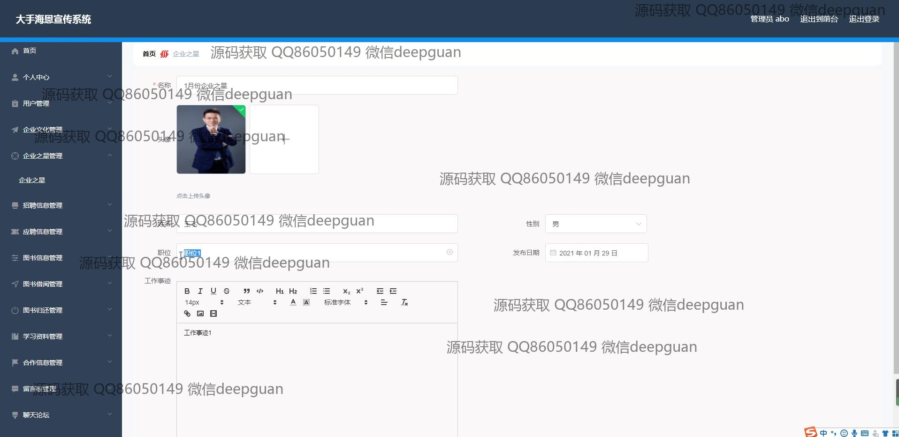

<h1 align="center">的大手海恩企业宣传网站vue</h1>

## 简介
企业宣传管理系统：角色分为管理员、用户；功能包括用户管理、企业信息管理、企业文化管理、招聘信息管理、学习资料管理、留言反馈、图书借阅管理。    --计算机毕业设计源码；毕设源码；java毕业设计源码

## 联系方式

<h3 align="center">获取完整代码与数据库文件 + 微信：deepguan QQ: 86050149 QQ群: 783742310</h3>

<h3 align="center">可帮忙远程部署 包运行成功！提供远程部署、修改代码、设计文档指导、代码讲解等服务！</h3>

## 功能介绍（完整见运行截图）
管理员：基本功能包括登录、注册和退出操作。后台管理提供企业信息编辑、用户管理、招聘信息管理、企业文化管理、公告管理、学习资料管理和留言板管理等模块。支持通过富文本编辑器发布企业公告和文化信息，管理用户留言与招聘信息，并可对学习资料和图书借阅进行分类管理和操作。

用户：基本功能包括登录、注册、退出以及个人信息修改。用户可以浏览企业宣传信息，查看招聘岗位并提交简历，参与留言反馈并与管理员互动。同时可访问学习资料、企业文化和公告信息，方便获取企业动态和相关资料。

## 运行截图

本代码来源于网络,仅供学习参考使用!

